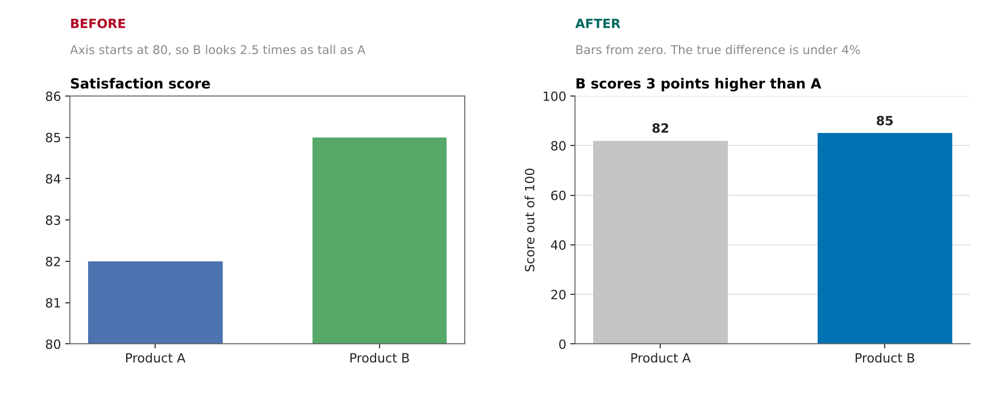
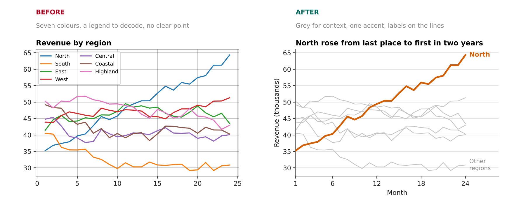
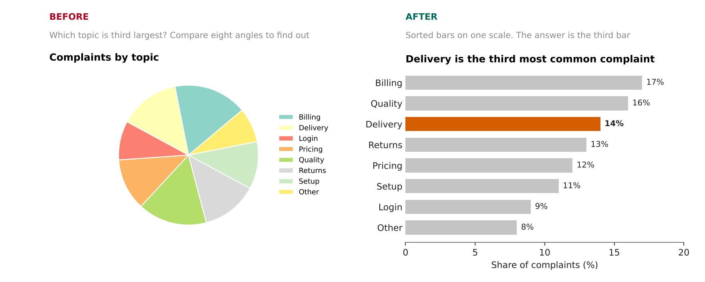
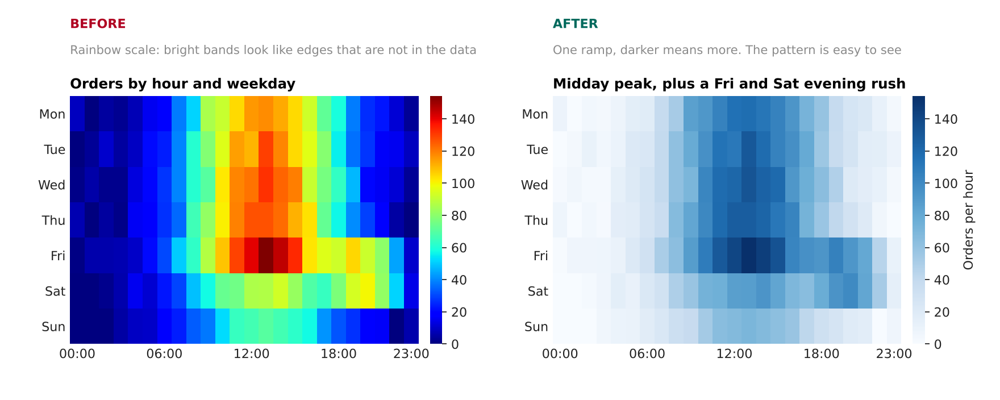
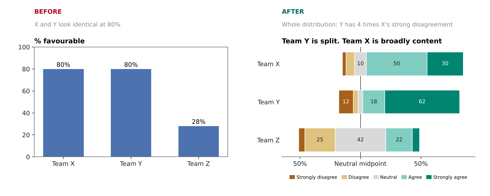
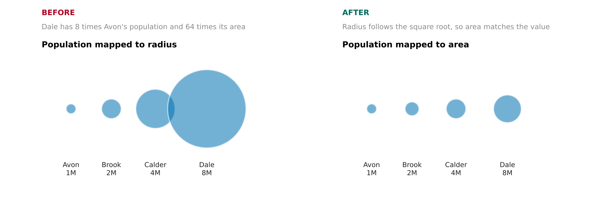

# dataviz-design

An agent skill that teaches AI coding agents to design charts, not just draw them.

Ask an AI agent for a chart and you get working code in seconds. Whether the chart is any good is a different question. Agents tend to accept whatever the plotting library does by default. That means a new colour for every bar, a legend with nine entries, an axis that starts wherever the data happens to start, and a title that repeats the column names. The code runs and the numbers are correct, but the reader still has to work out what the chart is trying to say. Sometimes the result is worse than unclear. A cut axis or a bubble sized by its radius can make a small difference look like a large one.

What is missing is design judgment. Someone who is good at charts asks a few questions before writing any code. Who is reading this, and what do they need to see? What does one row of the data stand for? Which comparison matters most, and is it shown in the way people read most accurately? Does every colour mean something? Would a reasonable reader come away with the right impression?

`dataviz-design` gives an agent that way of working. It takes well-established research on perception and statistical graphics and turns it into instructions an agent can follow:

- a workflow that starts by writing the headline and choosing the view that proves it, and ends with a lint, look and critique loop on the rendered image
- a claims-and-evidence guide that matches each kind of headline ("grew fastest", "overtook", "half of") to the chart that lets a reader check it
- a chart chooser that starts from what the reader needs to do
- seventeen defaults that prevent the most common mistakes, each with the reason behind it
- reference files for each chart family, colour, data preparation, layout and typography, and honest presentation
- eighteen worked redesigns, each with numbers you can check
- **chartlint**, a layout linter that checks a drawn matplotlib figure for overlapping or clipped text, bars that do not start at zero, squashed series, too many colours and more
- **chartkit**, matplotlib helpers for destination-sized output, a clean title block, collision-free direct labels and evenly spaced value labels
- a palette checker for contrast and colour-blind safety

It also stays out of the way. The agent reads a short entry file when a charting task comes up, and opens a reference file only when the task calls for it.

The skill is about design decisions, so it works with any plotting tool: matplotlib, seaborn, plotly, ggplot2, D3, Vega-Lite, Excel, Tableau, Power BI.

## Install

```bash
npx skills add Dheemant19/dataviz-design-skill
```

This uses the [skills CLI](https://github.com/vercel-labs/skills), which installs into Claude Code, Cursor, Codex and other agents that support the [Agent Skills](https://agentskills.io) format.

To install by hand, copy the `skills/dataviz-design` folder into your agent's skills directory (for Claude Code, `.claude/skills/` in a project or `~/.claude/skills/` for all projects).

## What it changes

Each pair below shows one rule from the skill. The data is invented, and the figures are drawn by [`examples/make_examples.py`](examples/make_examples.py).

### Bars start at zero

A bar's length is its value. Cutting the axis turns a 3-point gap into a bar 2.5 times as tall.



### Grey for context, one colour for the point

Seven colours and a legend make the reader do the work. One accent colour and direct labels make the chart say something.



### Sort it, and use position instead of angle

People compare lengths on a shared scale far more accurately than angles. If the reader has to rank, do the ranking for them.



### The palette follows the data

Numeric data needs a ramp whose lightness changes steadily. A rainbow scale creates bright bands that look like boundaries in the data.



### Show the distribution, not one number

Two teams with the same "80% favourable" can be very different. A diverging stacked bar keeps the answer scale in order and shows the whole picture.



### Size means area

Map a value to circle radius and a city 8 times as large is drawn 64 times as big. Radius must follow the square root of the value.



## What is inside

```
skills/dataviz-design/
├── SKILL.md                         workflow, chart chooser, 17 core defaults
├── references/
│   ├── claims-and-evidence.md       headlines, measures, proof views, composite panels
│   ├── data-and-preparation.md      profiling, aggregate rows, scale types, joins, missing data
│   ├── encoding-and-perception.md   channels, accuracy ranking, attention, grouping
│   ├── colour.md                    palette families, accessibility, legends
│   ├── comparison.md                bars, lines, axes, log scales, smoothing, small multiples
│   ├── composition.md               pies, stacked bars and areas, treemaps, waterfalls, funnels
│   ├── relationships.md             scatterplots, trend lines, uncertainty, bubbles, heatmaps
│   ├── distributions.md             histograms, box plots, violins, density, ECDF
│   ├── explanation-and-honesty.md   titles, annotation, emphasis, misleading patterns
│   ├── layout-and-typography.md     sizes, type scale, text budget, labels, number formats
│   ├── worked-redesigns.md          18 before and after cases with numbers
│   ├── review-checklist.md          design brief, recipes, critique loop, final review
│   ├── library-notes.md             defaults that matter in matplotlib, seaborn, pandas,
│   │                                plotly, ggplot2, Vega-Lite and D3
│   └── sources.md                   the research each rule comes from
└── scripts/
    ├── chartkit.py                  matplotlib helpers for finished charts
    ├── chartlint.py                 layout and encoding linter for matplotlib figures
    └── check_palette.py             palette checker, Python standard library only
```

The agent always sees only the skill's name and description. It loads `SKILL.md` (about 200 lines) when a charting task comes up, and opens a reference file only when the task needs it. A request for a stacked bar chart pulls in `composition.md` and nothing else.

## Try it

After installing, ask your agent things like:

- "Plot monthly revenue for our nine regions from sales.csv."
- "Which chart should I use to show how survey answers differ between three teams?"
- "Here is my chart code. Is anything about this misleading?"
- "Pick colours for a heatmap of change versus last year."
- "My boss wants a pie chart of these 12 categories. Make it work."

## Checks and helpers

### chartlint

A palette checker can only judge colours. Most of what goes wrong in an agent's chart is layout and encoding, and that can be measured once the figure is drawn. Run any plotting script through `chartlint` and every figure it saves is checked first, with no changes to the script:

```console
$ python skills/dataviz-design/scripts/chartlint.py make_chart.py
chartlint: chart.png
  FAIL bar-baseline [panel 2]: The value axis starts at 80, not zero, so bar lengths exaggerate differences. Start at zero or switch to dots.
  WARN too-many-colours [panel 1]: 7 differently coloured lines. Readers cannot match that many colours. Show the series that matter in colour and the rest in grey, or use small multiples.
  WARN squashed-series [panel 1]: 7 of 8 lines sit in the bottom 15% of the axis, so they cannot be read or compared. If the message is about change, index each series to a start value or show percent change. ...
  WARN legend-size [panel 1]: The legend has 8 entries. Label series directly, highlight the few that matter, or split into small multiples.
  Result: FAIL (1 fail, 4 warn)
```

It also checks for overlapping and clipped text, small fonts, unequal bar widths, crowded or exploded pies, dual axes, 3D panels, rainbow and off-centre colour maps, unlabelled log scales, too many callouts, text over budget, and colour pairs that fail colour-vision checks.

### chartkit

Helpers that do the fiddly parts of a finished matplotlib chart:

```python
import chartkit as ck

ck.apply_style("slide")          # slide, report, web, social or square
fig, ax = ck.figure()
for name, s in series.items():
    ax.plot(s.index, s.values, label=name, **ck.emphasis(name, focus="North"))
ck.label_lines(ax, focus="North", values=True)   # end labels that never collide
ck.tidy(ax)
ck.finish(fig, "chart.png", title="North overtook every other region in 2024",
          subtitle="Monthly revenue, thousand dollars", source="Source: sales ledger",
          alt="Line chart of monthly revenue ...")
```

`finish` adds a left-aligned title block and footer, lays everything out inside the canvas, runs `chartlint`, saves at the size and resolution for the destination, and writes the alt text next to the image.

### check_palette

Checks a palette before it goes into a chart: contrast against the background, distinctness under three simulated types of colour-vision deficiency and in greyscale, and ordering of sequential and diverging ramps.

```console
$ python skills/dataviz-design/scripts/check_palette.py "#FF0000" "#00A000"
...
FAIL [distinct] #FF0000 and #00A000 are nearly identical under deuteranopia (distance 0.041).
Result: FAIL
```

## Where the rules come from

The skill summarises established findings from statistics, perception research and visualisation design, including work by Bertin, Cleveland and McGill, Stevens, Tufte, Tukey, Kosslyn, Mackinlay, Brewer and Munzner. Every source is listed in [`sources.md`](skills/dataviz-design/references/sources.md), so any rule can be traced and cited.

The checker's thresholds are heuristics, and so are several of the design rules. The skill says which rules are arithmetic, which are strong defaults and which are judgment calls.

## Contributing

Issues and pull requests are welcome. Useful contributions include corrections with a source, notes on library defaults that have changed, and new worked redesigns.

To redraw the README figures:

```bash
pip install matplotlib numpy
python examples/make_examples.py
```

Test prompts for evaluating changes to the skill are in [`evals/evals.json`](evals/evals.json). The scripts have smoke tests: `python tests/test_scripts.py` (or `pytest tests`).

## Licence

MIT. See [LICENSE](LICENSE).
